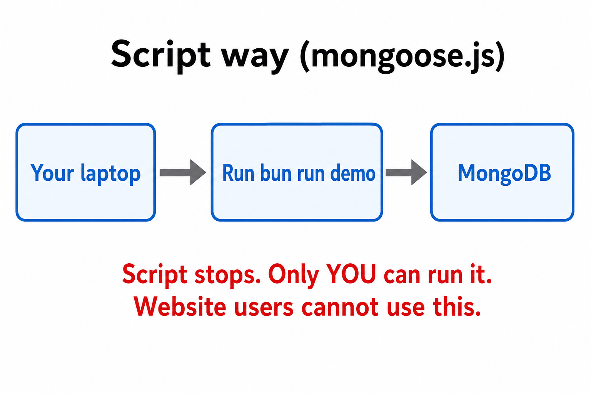
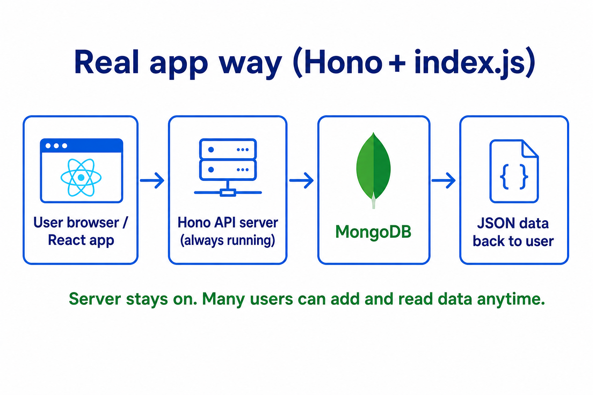
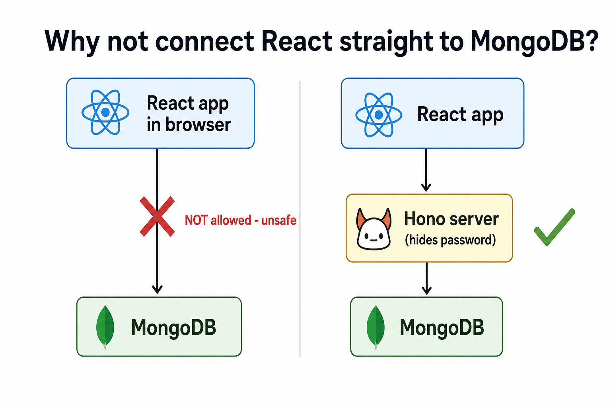

# Backend + MongoDB

Learn MongoDB with scripts first. Then learn why real apps need a **server + Hono**.

**Slides:** [Intro to HTTP](https://petal-estimate-4e9.notion.site/Intro-to-HTTP-26c5803f153b4401aa76e9fac08ac427) — read this first.

---

## Why do we need Hono? (simple answer)

### What we did before (`mongoose.js`)

You run a script on your laptop:

```bash
bun run demo
```

It connects to MongoDB, adds data, and **stops**.



**Good for:** learning how MongoDB works.
**Bad for a real website because:**

- The script **stops** after it runs. It is not always on.
- **Only you** can run it. Users on your site cannot.
- A **React app in the browser cannot connect to MongoDB**. Browsers are not allowed to hold your DB password.
- If you put the password in React, **anyone can steal it** from the browser.

### What we do now (`index.js` + Hono)

Hono is a **web server**. It stays running and waits for requests.



```
User clicks "Add course" in React
        ↓
React sends: POST http://localhost:3000/courses
        ↓
Hono server gets the request
        ↓
Mongoose saves to MongoDB
        ↓
Hono sends JSON back to React
```

**This is how real apps work.**

### Why React cannot talk to MongoDB directly



|                           | Script (`mongoose.js`) | Real app (`index.js` + Hono) |
| ------------------------- | ---------------------- | ---------------------------- |
| Who runs it?              | You, manually          | Server, always on            |
| Can website users use it? | No                     | Yes                          |
| Works with React?         | No                     | Yes                          |
| DB password safe?         | On your laptop only    | Hidden on server             |

---

## Setup

```bash
cd server
bun install
cp .env.example .env   # only if you need Atlas or a custom URI
```

---

## Part 1 — MongoDB scripts (`mongoose.js`)

Learn connect, insert, read, update, delete **in code on your laptop**.

```bash
bun run demo
```

Uncomment one step at a time at the bottom of `mongoose.js`.

---

## Part 2 — HTTP API (Hono)

Two files — use both when teaching:

| File                            | Purpose                                       | Run with               |
| ------------------------------- | --------------------------------------------- | ---------------------- |
| `index.step-by-step.example.js` | **Learning** — build APIs one step at a time  | `bun run dev:learning` |
| `index.js`                      | **Real app** — all routes on, like production | `bun run dev`          |

### Real app

```bash
bun run dev
```

All endpoints work at the same time.

### Routes

| Method | Route          | What it does     |
| ------ | -------------- | ---------------- |
| GET    | `/`            | Health check     |
| GET    | `/users`       | List all users   |
| POST   | `/users`       | Create a user    |
| PATCH  | `/users/:id`   | Update a user    |
| DELETE | `/users/:id`   | Delete a user    |
| GET    | `/courses`     | List all courses |
| POST   | `/courses`     | Create a course  |
| PATCH  | `/courses/:id` | Update a course  |
| DELETE | `/courses/:id` | Delete a course  |

### Try it

**Create a user**

```bash
curl -X POST http://localhost:3000/users \
  -H "Content-Type: application/json" \
  -d "{\"name\":\"Alice\",\"email\":\"alice@example.com\",\"role\":\"student\"}"
```

**Get all users**

```bash
curl http://localhost:3000/users
```

**Create a course**

```bash
curl -X POST http://localhost:3000/courses \
  -H "Content-Type: application/json" \
  -d "{\"title\":\"React 101\",\"description\":\"Basics\",\"price\":49.99,\"instructor\":\"Bob\",\"published\":true}"
```

**Update** — copy `_id` from a response:

```bash
curl -X PATCH http://localhost:3000/users/PASTE_ID_HERE \
  -H "Content-Type: application/json" \
  -d "{\"name\":\"Alice Johnson\"}"
```

**Delete**

```bash
curl -X DELETE http://localhost:3000/users/PASTE_ID_HERE
```

Use [Postman](https://www.postman.com/) or Thunder Client if you prefer a UI.

---

## Files

| File                            | Purpose                                       |
| ------------------------------- | --------------------------------------------- |
| `models.js`                     | User + Course schemas                         |
| `mongoose.js`                   | Learn MongoDB with scripts (your laptop only) |
| `index.step-by-step.example.js` | Learn APIs step by step                       |
| `index.js`                      | Real Hono server (for your website)           |
| `images/`                       | Diagrams explaining script vs real app        |

## Next step

Call these APIs from your React app with `fetch`.

---

## Part 3 — Connect React (client)

The React app lives in the **project root** (`src/`). It talks to this server over HTTP — never to MongoDB directly.

### Run both at once

**Terminal 1 — server (this folder):**

```bash
bun run dev
```

**Terminal 2 — React (project root):**

```bash
cd ..
bun run dev
```

Open **http://localhost:5173**.

### What happens when you click "Load courses"

```
React (port 5173)                Hono (port 3000)              MongoDB
      |                                |                          |
      |  fetch("/api/courses")         |                          |
      |  ─────────────────────────►  |                          |
      |  (Vite proxy strips /api)      |  Course.find()           |
      |                                |  ───────────────────────►  |
      |                                |  ◄───────────────────────  |
      |  ◄─────────────────────────  |  JSON array of courses   |
      |  setCourses(data)            |                          |
```

### Files involved

| File | Role |
| ---- | ---- |
| `src/api.js` | `getCourses()`, `createCourse()`, etc. — wraps `fetch` |
| `src/App.jsx` | UI; calls `api.js` on button click / form submit |
| `vite.config.js` | Proxies `/api/*` → `http://localhost:3000/*` in dev |
| `index.js` (here) | `cors()` so browser requests from port 5173 are allowed |

### Why the Vite proxy?

React and Hono run on **different ports**. Without the proxy you would write:

```js
fetch("http://localhost:3000/courses")  // works, but hardcodes URL + needs CORS
```

With the proxy:

```js
fetch("/api/courses")  // Vite forwards to localhost:3000/courses
```

Same-origin in dev = simpler `fetch` calls. CORS is still enabled on the server for when you call the API directly (Postman, curl, or production).

### Why CORS in `index.js`?

Browsers block JavaScript from reading responses from another origin unless the server sends `Access-Control-Allow-Origin`. React is on `5173`, Hono on `3000` — different origins.

```js
import { cors } from "hono/cors";

app.use("/*", cors({
  origin: ["http://localhost:5173", "http://127.0.0.1:5173"],
}));
```

**Without this:** `fetch` might fail in the browser even though curl works.

### Try the UI

1. **Load courses** — `GET /courses` via `getCourses()`
2. **Add course** — form submit → `POST /courses` with JSON body
3. **Delete** — `DELETE /courses/:id`

The status bar at the bottom of the React app shows which request ran. Open DevTools → Network to see the real HTTP traffic.

### `api.js` pattern (mirror of server routes)

Server route:

```js
app.post("/courses", async (c) => {
  const course = await Course.create(await c.req.json());
  return c.json(course, 201);
});
```

Client call:

```js
export function createCourse(course) {
  return request("/courses", {
    method: "POST",
    body: JSON.stringify(course),
  });
}
```

Same URL path, same JSON shape — client and server are a matched pair.

Full client guide: [`../README.md`](../README.md).
